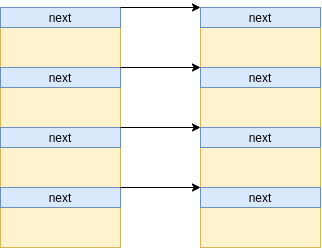
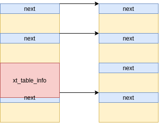
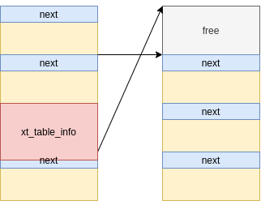

# 漏洞描述

netfilter的溢出漏洞，通过堆喷、UAF、ROP等漏洞利用方法实现了本地提权以及容器逃逸，exp绕过了KASLR、SMAP、SMEP以及Capabilities等安全机制。[背景知识](./background.md)列举了所需要补充的一些知识。

# 漏洞详情
在内核代码`net/netfilter/x_tables.c`中的`xt_compat_target_from_user`中：

```c
void xt_compat_target_from_user(struct xt_entry_target *t, void **dstptr, unsigned int *size)
{
	const struct xt_target *target = t->u.kernel.target;
	struct compat_xt_entry_target *ct = (struct compat_xt_entry_target *)t;
	int pad, off = xt_compat_target_offset(target);
	u_int16_t tsize = ct->u.user.target_size;
	char name[sizeof(t->u.user.name)];

	t = *dstptr;
	memcpy(t, ct, sizeof(*ct));
	if (target->compat_from_user)
		target->compat_from_user(t->data, ct->data);
	else
		memcpy(t->data, ct->data, tsize - sizeof(*ct));
	pad = XT_ALIGN(target->targetsize) - target->targetsize;
	if (pad > 0)
		memset(t->data + target->targetsize, 0, pad);

	tsize += off;
	t->u.user.target_size = tsize;
	strlcpy(name, target->name, sizeof(name));
	module_put(target->me);
	strncpy(t->u.user.name, name, sizeof(t->u.user.name));

	*size += off;
	*dstptr += tsize;
}
```
`memset(t->data + target->targetsize, 0, pad)`中，`target->targetsize`没有经过检查，可能会导致堆溢出。 这条语句被触发的条件是`target->targetsize`是一个不被8整除。


targetsize不是完全由用户控制的，但是可以通过选择不同的targets造成不同的溢出长度。

buffer在如下函数中被分配，注意其区修饰符为`GFP_KERNEL_ACCOUNT`。后续的漏洞利用所使用的内存都应该选择使用`GFP_KERNEL_ACCOUT`修饰符描述的内存。


```c
struct xt_table_info *xt_alloc_table_info(unsigned int size)
{
	struct xt_table_info *info = NULL;
	size_t sz = sizeof(*info) + size;

	if (sz < sizeof(*info) || sz >= XT_MAX_TABLE_SIZE)
		return NULL;

	info = kvmalloc(sz, GFP_KERNEL_ACCOUNT);
	if (!info)
		return NULL;

	memset(info, 0, sizeof(*info));
	info->size = size;
	return info;
}
```

# 漏洞利用

## 0x00 建立沙箱

1. 建立userns、netns以获取权限；
2. 设定代码执行在特定的CPU上。

## 0x01 建立堆布局

选择使用消息队列进行堆喷：
1. 创建4096个消息队列
2. 向这4096个消息队列中发送消息，长度为4096字节（在包含`struct msg_msg`头的情况下，实际长度为4k-sizeof(msg_msg)），此时内存布局如下图所示。背景知识参考：[msgsnd](./background.md#`msgsnd()`)


**注：实际内存中不一定是连续的，所以才需要堆喷，大概率得到如此的内存布局。
由于消息可以自定义，每条消息会记录该条消息属于哪个消息队列**


3. 向这4096个消息队列中发送消息，长度为1024字节（在包含`struct msg_msg`头的情况下，实际长度为4k-sizeof(msg_msg)），此时内存布局如下图所示。



**由于消息可以自定义，每条消息会记录该条消息属于哪个消息队列**


4. 从这4096个消息队列中选择一部分读取消息，导致内存被释放
5. 通过`setsockopt`系统调用触发到漏洞所在函数，内存会被分配到刚刚释放的地址空间中。由于溢出导致下一条消息的头部被覆盖，其内存布局如下：



消息的头部恰好是一个链表指针指向这个消息队列的下一条消息，被覆盖后该指针被改写，可能会出现一种情况，该指针指向另一个消息队列的第二条消息，如图所示：


6. 通过peek的方式读取每一个消息队列（跳过步骤4中被选中的消息队列）中第二次发送的消息，检查消息中步骤3设计的字段是否和消息队列匹配，如果不匹配则找到了被漏洞修改的指针。记录其正确的序号和被改写后的序号。

7. 使用正确的序号，将该消息队列的第二条消息读取（该内存被释放），其内存布局如图所示：



## 0x02 绕过SMAP

本阶段的目的是：获取上文步骤7中被释放的消息真实的内核地址

1. 利用`socketpair`去堆喷一些消息，消息内容可以任意指定，长度为1024。会有消息被喷到刚刚释放的内存中。

- 仿照消息队列的形式对内容进行构造，指定msg_msg域中的m_ts域为DATALEN_MSG

2. 通被改写后的序号对该消息队列进行peek，这样再一次导致溢出并且泄露了与1024消息相邻的下一条消息的内容。

- 由于构成了双向的循环链表，所以相邻的下一条消息头部的链表指针指向first_message，获取到了下一条消息

3. 从socket中读出消息，相当于释放了内存

4. 再一次利用socketpair进行堆喷，指定msg_msg域中的next域值为步骤2中泄露的地址减去sizeof(msg_msgseg)，这样伪造了其作为第一条消息的第一段消息，而第二段消息则指向4096消息。

5. 通过改写后的序号对该消息队列进行peek

- 获取first message的next指针，即second message的内存地址。该地址减去1024即为UAF区域的内存地址。

## 0x03 绕过KASLR

此阶段的目标是绕过内核地址随机化，即获取内核基址。

1. 从socket读出消息，相当于释放了内存

2. 第三次利用`socketpair`进行堆喷，使得UAF区域的链表头指向本身

3. 读消息队列，释放该内存空间

4. 堆喷pipe类型的对象

5. 从socket中读出消息，从而获取`pipe_buffer_ops`的地址，进而推算出内核基地址。

## 0x04 布置ROP

1. 第四次利用`socketpair`进行堆喷，其内存布置如下：

	1. 覆盖pipe_buffer_ops的地址为 UAF地址基址+0x290 
	2. 覆盖ops->release指针为[PUSH RSI; JMP QWORD PTR [RSI+0x39]]的地址(执行到此时，RSI寄存器的值为UAF地址基址)
	3. 覆盖UAF地址基址+0x39的值为[POP RSP;RET]的地址
	4. 覆盖UAF地址基址的值为[ADD RSP, 0D0H; RET]的地址
	5. ROP起点为UAF地址基址+0xD8
	6. 通过ROP执行：保存RBP、commit_creds(prepare_kernel_cred(0))、switch_task_namespaces(find_task_by_vpid(i),init_nsproxy)、恢复RBP

> 分析：ROP的关键在于对于栈的切换，由于处于不可执行的内存上，无法直接将payload放置在堆的空间上。经过两个gadget将UAF区域设置为栈，在栈上布置了ROP链。

2. 关闭pipe，导致release函数被调用，控制流被攻击者劫持
3. 切换namespace
4. 进行清理，关闭所有消息队列
5. 弹出一个root shell

# 搭建环境

1. 下载内核

https://ubuntu.pkgs.org/20.04/ubuntu-updates-main-amd64/linux-image-5.8.0-48-generic_5.8.0-48.54~20.04.1_amd64.deb.html

```
sudo apt-get install linux-image-5.8.0-48-generic
```


2. 修改grub

需要修改`/etc/default/grub`文件
```
GRUB_DEFAULT="1 >6"
```

更新内核并重启
```
sudo update-grub
sudo reboot
```

3. 重启后

```
uname -r
```

# 参考资料

- [一个内核网络漏洞详解|容器逃逸](https://mp.weixin.qq.com/s/zFDNafu6ArKKwmlkwf-A6w)
- [CVE-2021-22555: Turning \x00\x00 into 10000$](https://github.com/google/security-research/blob/master/pocs/linux/cve-2021-22555/writeup.md#escaping-the-container-and-popping-a-root-shell)